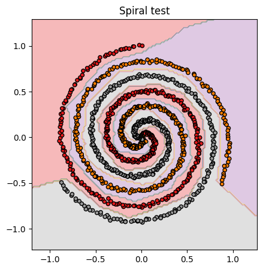

# vect-micrograd

<p align="center">
  
  
</p>

A small, vectorized extension of Andrej Karpathy's [micrograd](https://github.com/karpathy/micrograd).

The idea is the same as scalar micrograd: build a dynamic DAG during the forward pass, then run reverse-mode automatic differentiation through it. The difference is that each `Value` stores a NumPy array instead of a Python scalar. That turns a dense layer from thousands of scalar operations into a few array operations: matrix multiplication, bias addition, activation, reduction, and loss.

This is an educational project, not a production deep-learning framework.

## What this includes

- A NumPy-backed `Value` class with reverse-mode autodiff.
- Broadcasting-aware gradients through `_unbroadcast`.
- Array operations for `+`, `-`, `*`, `/`, powers, `@`, `sum`, `mean`, `exp`, `log`, `relu`, and `tanh`.
- A fused `softmax_ce` operation for stable softmax cross-entropy.
- Minimal neural-network helpers: `Module`, `Layer`, and `MLP`.
- Optimizers: `SGD`, `Adam`, and `Lion`.
- Utility functions for minibatching, one-hot encoding, classification losses, and checkpointing.
- Numerical-gradient and unit tests for the core engine.

## Installation

Clone the repository and install it in editable mode:

```bash
git clone https://github.com/pvilanova/vect_micrograd.git
cd vect_micrograd
python -m pip install -e .
```

The package dependency is just NumPy.

For tests and notebooks, install the extra tools you need, for example:

```bash
python -m pip install pytest jupyter matplotlib
```

## Quick start

### Basic autodiff

```python
import numpy as np
from vect_micrograd.vect_engine import Value

x = Value(np.array([1.0, 2.0, 3.0]))
w = Value(np.array([0.5, -1.0, 2.0]))

loss = ((x * w).sum()) ** 2
loss.backward()

print(loss.data)
print(x.grad)
print(w.grad)
```

### Train a small MLP with softmax cross-entropy

```python
import numpy as np

from vect_micrograd.vect_nn import MLP
from vect_micrograd.optim import Adam
from vect_micrograd.utils import sample_batch, one_hot, cross_entropy_loss

# X: shape (n_examples, n_features)
# y: integer labels, shape (n_examples,), values in {0, ..., classes - 1}
classes = 3
model = MLP(2, [16, 16, classes])
optimizer = Adam(model.parameters(), lr=1e-2, total_steps=1000)

for k in range(1000):
    Xb, yb = sample_batch(X, y, batch_size=64)
    targets = one_hot(yb, classes)

    loss, acc = cross_entropy_loss(model, Xb, targets, alpha=1e-4)

    optimizer.zero_grad()
    loss.backward()
    optimizer.step(k)

    if k % 100 == 0:
        print(k, loss.item(), acc)
```

### Binary max-margin loss

```python
from vect_micrograd.vect_nn import MLP
from vect_micrograd.optim import SGD
from vect_micrograd.utils import svm_loss

# y_pm1 should contain -1 / +1 labels, commonly shaped (n_examples, 1)
model = MLP(2, [16, 16, 1])
optimizer = SGD(model.parameters(), lr=1.0, total_steps=1000, momentum=0.9)

for k in range(1000):
    loss, acc = svm_loss(model, X, y_pm1, alpha=1e-4)

    optimizer.zero_grad()
    loss.backward()
    optimizer.step(k)
```

## Design notes

### Vectorized `Value`

In scalar micrograd, every scalar in a dense layer becomes a node in the graph. Here, a `Value` can hold an entire NumPy array, so a layer can be represented by a small number of graph nodes:

```python
out = x @ W + b
```

The graph is still dynamic, and `backward()` still walks it in reverse topological order.

### Broadcasting-aware gradients

NumPy broadcasting expands smaller arrays during the forward pass. During the backward pass, gradients must be summed back to the original operand shape.

Example:

```python
x.shape == (200, 32)
b.shape == (32,)
out = x + b
```

The gradient for `b` must have shape `(32,)`, not `(200, 32)`. `_unbroadcast` handles that reduction.

### Matrix multiplication

The engine implements the common dense-layer case:

```text
X @ W

X.shape = (batch, in_features)
W.shape = (in_features, out_features)

dL/dX = dL/dY @ W.T
dL/dW = X.T @ dL/dY
```

It also supports vector/matrix convenience cases. Higher-dimensional batched matmul is intentionally unsupported to keep the engine small and readable.

### Fused softmax cross-entropy

`Value.softmax_ce(targets)` computes softmax probabilities and cross-entropy loss together:

```python
loss, probs = logits.softmax_ce(targets)
```

This keeps the loss numerically stable and gives the compact backward gradient:

```text
dL/dlogits = (probs - targets) / batch_size
```

### Optimizers

All optimizers share a small `Optimizer` base class and the same `step(k)` interface.

```python
from vect_micrograd.optim import SGD, Adam, Lion

optimizer = SGD(model.parameters(), lr=1.0, total_steps=1000, momentum=0.9)
optimizer = Adam(model.parameters(), lr=1e-2, total_steps=1000, weight_decay=1e-2)
optimizer = Lion(model.parameters(), lr=1e-4, total_steps=1000, weight_decay=1e-2)
```

If `total_steps` is provided, the learning rate decays linearly to 10% of its initial value by the final step.

### Neural-network helpers

`Layer` uses He initialization:

```text
W ~ N(0, sqrt(2 / nin))
```

`MLP` accepts a custom activation function:

```python
from vect_micrograd.vect_engine import Value
from vect_micrograd.vect_nn import MLP

model = MLP(2, [16, 16, 3])                         # ReLU by default
model = MLP(2, [16, 16, 3], activation=Value.tanh)  # tanh
```

## Package structure

```text
vect_micrograd/
    __init__.py
    vect_engine.py   # Value class and autograd primitives
    vect_nn.py       # Module, Layer, MLP
    optim.py         # Optimizer, SGD, Adam, Lion
    utils.py         # batching, one-hot labels, losses, checkpointing

tests/
    test_value.py    # numerical gradient checks and unit tests

vect_demo.ipynb      # checkerboard binary classification
spiral_demo.ipynb    # three-class spiral classification
mnist_demo.ipynb     # MNIST demo
checker.png
spiral.png
setup.py
```

## Demos

- `vect_demo.ipynb` — checkerboard binary classification with SVM loss.
- `spiral_demo.ipynb` — three-class spiral classification with softmax cross-entropy.
- `mnist_demo.ipynb` — MNIST classification demo.

## Running tests

```bash
python -m pip install pytest
pytest tests/test_value.py -v
```

The tests cover scalar operations, repeated graph use, broadcasting, matrix multiplication, activations, reductions, and fused softmax cross-entropy.

## Limitations

- First-order autodiff only.
- NumPy CPU arrays only.
- No batched matrix multiplication for operands with more than two dimensions.
- No production features such as serialization formats, GPU kernels, mixed precision, or graph visualization.
- Designed for learning and experimentation, not large-scale training.

## License

MIT.